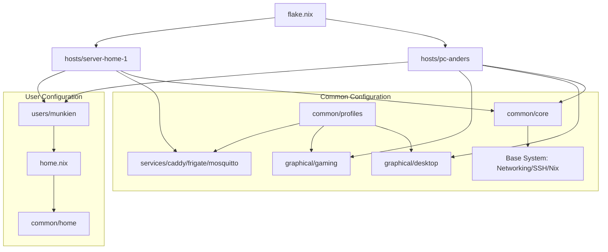

# Munkiens Fleet: Strictly Declarative Multi-Arch NixOS

This repository houses the strictly declarative, multi-architecture configuration for Munkiens' fleet of NixOS machines. It is built upon a stateless root filesystem architecture, modern secrets management, next-generation copy-on-write storage, and advanced performance profiling.

---

## Directory Topology

```
.
├── common/
│   ├── core/              # Global baseline system configuration (networking, SSH, Tailscale, base packages)
│   ├── profiles/          # Modular optional profiles (services like caddy/frigate, graphical, gaming)
│   ├── home/              # Shared Home Manager modules and styling profiles (Stylix, Plasma-Manager)
│   ├── impermanence.nix   # Global stateless preservation rules
│   └── options.nix        # Fleet-wide feature flag/option declarations
├── hosts/                 # Host-specific hardware, layout, and override definitions
│   ├── pc-anders/         # Workstation host config (x86_64, bcachefs multi-tier, Plasma 6)
│   └── server-home-1/     # Home server host config (x86_64, single-pool bcachefs, Caddy/MQTT/Frigate)
├── users/                 # System user configuration
│   └── munkien/           # User 'munkien' profile, public keys, and home-manager payload
└── secrets/               # encrypted secrets directory managed by agenix-rekey
```

---

## 1. System Architecture & Design Philosophy

The configuration uses a modular, multi-tier layout to separate the universal baseline configuration from host-specific capabilities.



### Flake Structure & Multi-Arch
The fleet is managed using `flake-parts` to provide a clean schema for multi-architecture systems (`x86_64-linux` and `aarch64-linux`).
- **NixOS Configurations**: Evaluated per host in the `flake.nix` outputs. An additional `rescue` ISO target is provided for recovery.
- **Home Manager Configuration**: Standardized under `homeConfigurations.munkien` and imported by target systems.
- **Colmena integration**: Nodes from the deployed fleet are automatically mapped to a `colmenaHive` output for multi-node deployments.

### Fleet-Wide Feature Flags
We declare custom fleet-wide flags in `common/options.nix` within the `my` namespace:
- `my.graphical.enable`: Toggles desktop environments, display managers, graphic stacks, and graphical applications.
- `my.gaming.enable`: Activates gaming optimizations, Steam, GameMode, and GameScope.
- `my.server.enable`: Enables server-specific tuning and profiles.

### NixOS to Home Manager State Bridging
Home Manager configuration in `users/munkien/home.nix` references `osConfig`. This pattern exposes the machine's configuration state to the user's environment:
```nix
home.packages = with pkgs;
  lib.optionals osConfig.my.graphical.enable [
    # Packages are only evaluated and installed if graphical options are enabled on the host
  ];
```
This guarantees that terminal-only headless servers do not waste resources evaluating or installing GUI packages, while maintaining a unified user profile configuration.

---

## 2. Stateless Root & Impermanence

The fleet implements a **strictly stateless root** design. The root directory `/` is mounted as a volatile `tmpfs` RAM disk of `4GB`, which is wiped on every reboot. This forces complete declarative configuration and avoids configuration drift over time.

### The `preservation` Module
We utilize `preservation` (WilliButz/preservation) instead of the traditional `impermanence` module.

#### Why `preservation`?
1. **Granular Attribute-Driven Rules**: `preservation` allows declaring exactly how directories and files should be handled. For example, SSH host keys can be mapped as symlinks (`how = "symlink"`) and registered during the early boot phase (`inInitrd = true`).
2. **Explicit Parent Directory Configuration**: The `configureParent = true` option ensures that the parent directories of preserved files (e.g. `/etc/ssh`) are automatically created with correct permissions.
3. **Mount Ordering Safety**: By binding the activation to `/persist` explicitly and mapping dependencies correctly, `preservation` eliminates race conditions where services try to read credentials or databases before the persistent storage volume is ready.

The global rules in `common/impermanence.nix` preserve essential system state:
- System directories: `/var/lib/nixos`, `/var/lib/systemd/coredump`, `/var/lib/bluetooth`, `/var/lib/systemd/timers`, `/var/lib/tailscale`, `/etc/ssh`
- Critical files (like `/etc/machine-id` and `/etc/adjtime-id`) are mounted with `inInitrd = true` to preserve system identity across early boot stages.

---

## 3. Storage Topology & Bcachefs Multi-Tiering

All machines use `bcachefs`, the next-generation Linux copy-on-write filesystem. It provides built-in encryption, compression, multi-device tiering, and low-overhead subvolumes (simulated via bind mounts).

### PC-Anders (Multi-Tier Workstation)
The workstation `pc-anders` leverages a heterogeneous physical storage pool composed of NVMe SSDs, SATA SSDs, and HDDs. The layout is mapped in `hosts/pc-anders/filesystem.nix`:

- `/mnt/bcachefs`: The master pool mount point.
- Bind mounts (`/persist`, `/home`, `/nix`, `/var/log`, `/scratch`) point to subdirectories under the master pool.

#### Storage Tier Allocations
We apply performance profiles per subvolume:
- **Metadata**: Double-replicated and pinned to high-speed SSDs (`--metadata_target=ssd --metadata_replicas=2`) for fast file lookup.
- **`/home` & `/persist`**: Writes are foregrounded to SSD, reads are promoted to SSD, and cold data is moved to HDD in the background (`--foreground_target=ssd --promote_target=ssd --background_target=hdd`).
- **`/nix`**: Optimized exclusively for speed. All operations are kept on SSD (`--foreground_target=ssd --promote_target=ssd --background_target=ssd`).
- **`/scratch`**: Configured for large, transient files. Foreground writes go to SATA SSD, cold data is moved to HDD, and read operations are cached on SSD.
- **`/var/log`**: Low priority. Writes go to SATA, reads are cached on SATA, and cold logs reside on HDD.

#### Why the 120s Post-Boot delay for `bcachefs-infrastructure.service`?
Physical block devices in a multi-drive bcachefs pool are registered asynchronously by the kernel.
- If we configure storage target attributes (using `bcachefs set-file-option`) during the initial NixOS activation phase, the command will fail if any of the target physical drives (SSD, SATA, or HDD) have not finished registering.
- To prevent boot failures, we run the configuration as a **delayed systemd service** with a `OnBootSec = 120` timer. This guarantees all disk hardware is fully active and the pool is stabilized before applying storage-tier options.

### Server-Home-1 (Single-Pool Server)
On `server-home-1`, the storage topology is simpler. The system runs global optimizations (lz4 compression, zstd background compression, and safe error fixing) synchronously during the system boot cycle via NixOS `activationScripts`, as there is no multi-device tiering dependency.

---

## 4. Secrets Management & Rekeying Lifecycle

Secrets are encrypted using `agenix` and managed via `agenix-rekey`.

### Why `agenix-rekey`?
Traditional `agenix` setups encrypt secrets using the SSH public keys of both target hosts and users. However, if a host key is rotated or a new system is added to the fleet, every secret must be re-encrypted manually.

`agenix-rekey` automates this lifecycle:
1. Secrets are encrypted using a master identity key (typically a physical SSH key `~/.ssh/id_ed25519`).
2. When the flake environment is built (`nix flake check` or `nix develop`), the flake checks verify the secret encryption.
3. In the dev shell, `agenix-rekey` automatically re-encrypts the secrets for the respective target nodes using the public keys defined in their host directories (`hostPubkey.pub`).
4. This keeps secrets secure in the git repository while decoupling host key rotation from manual secret maintenance.

```
                  ┌───────────────────────┐
                  │   Master Identity     │
                  │   (Private SSH Key)   │
                  └───────────┬───────────┘
                              │ Decrypts
                              ▼
                   ┌─────────────────────┐
                   │  Raw Secret Payload │
                   └──────────┬──────────┘
                              │
             ┌────────────────┴────────────────┐
             ▼ Encrypts                        ▼ Encrypts
   ┌────────────────────┐            ┌────────────────────┐
   │ Host A Pubkey      │            │ Host B Pubkey      │
   │ (hostPubkey.pub)   │            │ (hostPubkey.pub)   │
   └─────────┬──────────┘            └─────────┬──────────┘
             ▼                                 ▼
   ┌────────────────────┐            ┌────────────────────┐
   │ target-secretA.age │            │ target-secretB.age │
   │   (For Host A)     │            │   (For Host B)     │
   └────────────────────┘            └────────────────────┘
```

---

## 5. Desktop Configuration & Performance Tuning

For graphical hosts, the system applies optimizations to ensure low-latency audio, fast desktop response, and reduced CPU/IO overhead.

### Plasma 6 Declarative Configuration
KDE Plasma 6 is configured using `plasma-manager` in `common/home/profiles/graphical/plasma.nix`.
- Dual monitors (screen `0` and `1`) share identical, declarative layouts (top widget panel + bottom applications dock).
- KWin blur and transparency effects are enabled with custom strengths (`strength = 12`).

### Resource Collision Avoidance via `mkDelayedStart`
To prevent the login session from stuttering or thrashing the CPU and disks, background user applications are started sequentially using a custom helper:
```nix
mkDelayedStart = name: delay: exec: {
  Unit = {
    Description = "${name} Autostart";
    After = ["graphical-session.target"];
  };
  Service = {
    ExecStartPre = "${pkgs.coreutils}/bin/sleep ${toString delay}";
    ExecStart = "${exec}";
    Restart = "on-failure";
  };
  Install = {WantedBy = ["graphical-session.target"];};
};
```
Heavy packages are systematically delayed: Steam (5s), Spotify (10s), Discord (15s), and Heroic Launcher (20s).

### IO Optimization (Baloo Indexer Tuning)
The KDE file indexer (Baloo) is notorious for resource consumption. We explicitly configure exclusions to prevent Baloo from indexing development environments:
- Excludes directories: `.cache`, `.nix-profile`, `.local/state`, `.cargo`.
- Excludes file types/patterns: `*.nix`, `node_modules`, `build`, `target`, and temporary compiler files.

### Low-Latency Audio Tuning
Pipewire is optimized in `common/profiles/graphical/desktop.nix` with low-latency constraints:
```nix
extraConfig.pipewire."92-low-latency" = {
  "context.properties" = {
    "default.clock.rate" = 48000;
    "default.clock.quantum" = 2048;
    "default.clock.min-quantum" = 512;
    "default.clock.max-quantum" = 2048;
  };
};
```
This forces the audio driver to operate at a stable clock rate of 48kHz and prevents stuttering by clamping the minimum quantum to 512 frames.

### Priority Scheduling via `ananicy-cpp`
Desktop environments run `ananicy-cpp` (configured with CachyOS optimization rules). This daemon dynamically monitors active processes, boosting the priority (niceness) of games, web browsers, and media players while lowering background compilation jobs.

---

## 6. Developer Workflow & Operations

### Deployment
The fleet is deployed using `colmena`, an lightweight NixOS deployment tool:
```bash
# Build and deploy the configurations to all tagged nodes
colmena apply

# Deploy only server nodes
colmena apply --on @servers
```

### Nix Garbage Collection (NH Integration)
Nix generations are managed using `nh` (Nix Helper) in `common/core/nix.nix`.
- System builds auto-cleanup daily via `nh.clean`.
- Configuration retains generations built within the last 30 days, or a minimum floor of 10 generations (`--keep-since 30d --keep 10`).
- The Nix compiler daemon is configured with a nice level of `19` and set to idle I/O class (`IOSchedulingClass = "idle"`) so compilation does not impact desktop interactivity.

### Git Hooks & Lints
To maintain code quality, the repository uses `git-hooks.nix` in the flake check suite:
- **Alejandra**: Enforces opinionated Nix formatting.
- **Deadnix**: Lints and removes unused Nix variables/let-bindings.
- **Statix**: Lints code style and anti-patterns.
- **Check-Symlinks**: Ensures broken symlinks do not slip into configurations.
